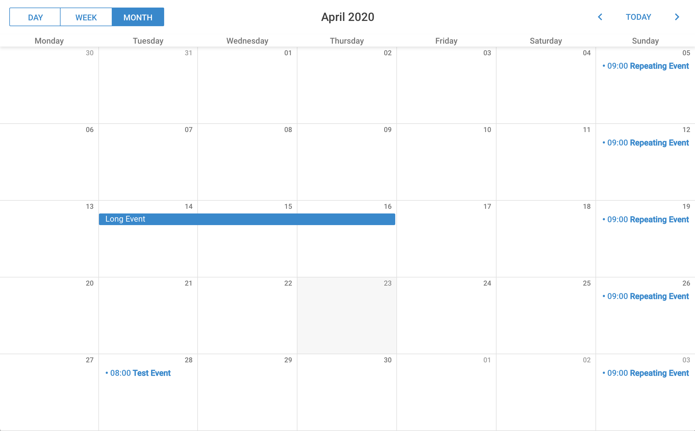

# Accessibility Calendar :calendar:
A lightweight, easy-to-use calendar application

# Description/Process
This application was built using the [DHTMLX Scheduler](https://docs.dhtmlx.com/scheduler/) framework as a backbone, with database integration handled by [MySQL](mysql.com).

Once the basic functionality is there, it's a simple matter to add more features such as repeatable events, timed reminders, and various date views. Due to our time constraints we chose to keep this implementation relatively simple, but other modular enhancements are just a few lines of code away.

# Screenshot

# User Story
We began this project as a way to create a more user-friendly calendar application for those with disabilities. Adding a text-to-speech module that reads the day's events aloud would help those with hearing impairments, whereas multiple color schemes could add more contrast for those who may suffer from any form of colorblindness.

So far these functionalities are still in-work, with plans to include them in the next build. Even so, without having implemented those features the app still scores an impressive 97/100 in Lighthouse's Accessibility audit.

# Future Development
- Add multiple color schemes, potentially with high-contrast options
- Implement text-to-speech module
- Include option for 12-hour time

## LINKS

[Home Repository](https://github.com/aseawright1/Accessibility_Calendar)

[Deployed Application](https://accessibility-calendar.herokuapp.com/)
